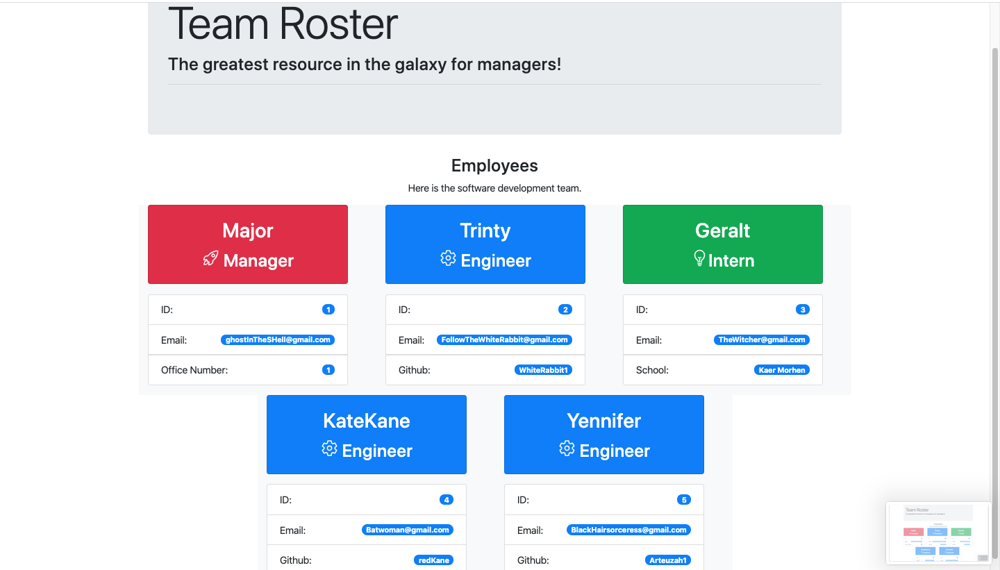

# Team Roster
 This app is a NODE Command Line that takes information about a software team and generates an HTML webpage. The webpage will display summaries for each person. The app's design pattern is based on tests written before in order to write maintainable code.  

## Requirements 
 
 * NPM Dependencies jest and inquirer 
 * Technologies: Node.js, JavaScript, HTML, CSS
 * Classes written in Javascript
 * HTML templates for main, engineer, intern, and manager
 * All tests must pass

## Application Demo

## User Story 
As a software team manager
I want to generate a webpage that displays my team's dossiers 
so that I have quick access to emails and GitHub Profiles.

## Business Context
Time is money and so is well organized information. 
Managers need pertenant information to make informed decisions 
to manage their project and team effectively. 
Having readily available dossiers all the selected team members view
helps keep the mind organized and ready to make a quick informed decision.

